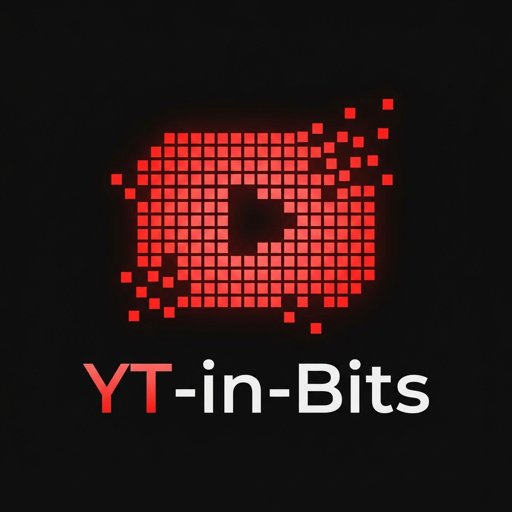

# YT-in-Bits

<center></center>

An AI-powered YouTube video summarizer that breaks any video down into clear, structured summaries in seconds.

Paste a YouTube URL, and YT-in-Bits fetches the transcript and uses Google Gemini to generate a concise summary, key topics, main takeaways, and a recommendation on whether the video is worth watching.

---

## Features

- Fetches transcripts directly from YouTube (no manual copying required)
- Generates structured AI summaries via Google Gemini
- Displays word count and transcript size stats after each summary
- Download summary as a plain text file
- Clean dark-themed Streamlit UI with Font Awesome icons
- CLI mode via `main.py` for terminal use

---

## Project Structure

```
.
├── app.py               # Streamlit web UI (imports logic from main.py)
├── main.py              # Core summarization logic + CLI entrypoint
├── get_transcript.py    # YouTube transcript fetcher
├── logo.png             # App logo
├── pyproject.toml       # Dependencies managed by uv
└── .env                 # API key (not committed)
```

---

## Setup

### Prerequisites

- Python 3.11+
- [uv](https://docs.astral.sh/uv/) package manager
- A Google Gemini API key

### Installation

```bash
# Clone the repository
git clone <your-repo-url>
cd "Youtube AI Summarizer"

# Install dependencies
uv sync
```

### Configuration

Create a `.env` file in the project root:

```env
YOUR_GOOGLE_API_KEY=your_gemini_api_key_here
```

---

## Usage

### Web App (Streamlit)

```bash
uv run streamlit run app.py
```

Open `http://localhost:8501` in your browser, paste a YouTube URL, and click **Break it into Bits**.

### Command Line

```bash
uv run python main.py
```

You will be prompted to enter a YouTube URL. The summary is printed to stdout.

---

## How It Works

1. `get_transcript.py` extracts the video ID from the URL and fetches the transcript using the `youtube-transcript-api` library.
2. `main.py` truncates the transcript to 12,000 characters (to stay within free-tier token limits), builds a structured prompt, and calls `gemini-3-flash-preview` via LangChain.
3. `app.py` handles the Streamlit UI and calls `summarize()` from `main.py` — no logic is duplicated between the two files.

---

## Dependencies

| Package | Purpose |
|---|---|
| `streamlit` | Web UI framework |
| `langchain-google-genai` | Gemini LLM integration |
| `youtube-transcript-api` | Fetching YouTube transcripts |
| `python-dotenv` | Loading API keys from `.env` |

---

## License

MIT
